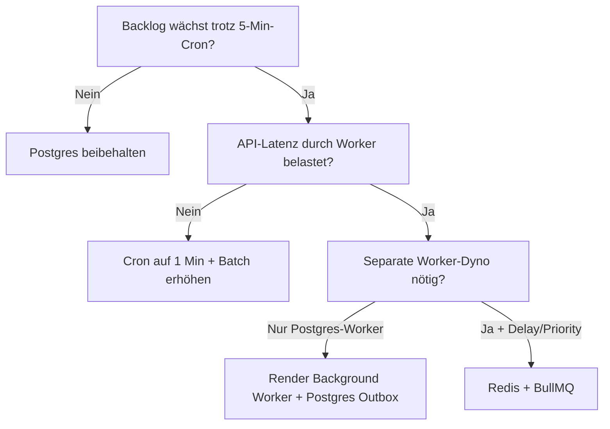
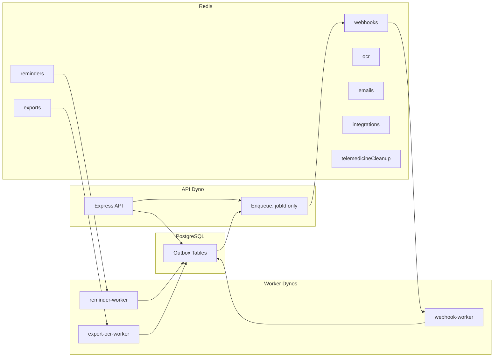

# Zukunftsplanung: Redis / BullMQ für MedScoutX

**Status:** Planung nur — **nicht implementiert**  
**Stand:** 2026-05-15  
**Bezug:** Postgres-Outbox + Render Cron (MVP), `server/worker/`, `docs/production/RENDER_CRON_WORKERS.md`

---

## Kurzfassung

MedScoutX nutzt heute **PostgreSQL als Source of Truth und Outbox** für Hintergrundarbeit. **Render Cron** ruft per HTTPS `POST /api/internal/worker/run` auf; `workerRunner` führt registrierte Processor sequentiell aus. Das reicht für MVP und frühe Produktion.

**Redis + BullMQ** werden erst sinnvoll, wenn Volumen, Latenz, Parallelität oder Queue-Features (Delayed Jobs, Prioritäten, dedizierte Worker-Dynos) die Grenzen von Cron-Polling und DB-Claims überschreiten.

**Grundsatz bei jeder Migration:** Business-State und Retry-Historie bleiben in **Postgres**. BullMQ ist nur **Trigger/Scheduler** — keine PHI, keine Dokumentinhalte, keine API-Keys im Job-Payload.

---

## Ist-Zustand (Analyse)

### Zentrale Worker-Struktur

| Komponente | Pfad | Rolle |
|------------|------|--------|
| Runner | `server/worker/workerRunner.js` | `runWorker()`, Fehler-Isolation, Audit `worker.run.*` |
| Registry | `server/worker/processorRegistry.js` | Processor → bestehende Services |
| Status | `server/worker/workerStatus.js` | Aggregierte Queue-Tiefen |
| Flags | `server/config/workerFlags.js` | `WORKER_ENABLED`, `WORKER_*_ENABLED` |
| Cron-Route | `POST /api/internal/worker/run` | `WORKER_CRON_SECRET`, 403 bei falschem Secret |
| Doku | `docs/production/RENDER_CRON_WORKERS.md` | Render Cron, curl, Sicherheit |

### Postgres-Outbox-Tabellen (Source of Truth)

| Domain | Tabelle(n) | Status-Flow | Worker / Processor |
|--------|------------|-------------|-------------------|
| Appointment reminders | `AppointmentReminder` | `pending` → `processing` → `sent` / `failed` / `cancelled` | `runAppointmentReminderWorker` |
| Webhooks (legacy) | `PracticeWebhookEvent` | `pending` / `retrying` → `processing` → `delivered` / `dead_letter` | `runWebhookWorker` |
| Webhooks (developer) | `PracticeWebhookDelivery` | wie oben | `runWebhookWorker` |
| Export | `ExportJob` | `pending` → `processing` → `completed` / `failed` / `expired` | `processExportJobs` |
| OCR | `DocumentOcrJob` | `pending` → `processing` → `completed` / `failed` | `processOcrJobs` |
| Telemedizin | `TelemedicineSession` (+ `TelemedicineParticipant`) | Session-Status, kein klassisches Job-Queue-Modell | `processTelemedicineCleanup` |
| Integration | `IntegrationJob` | heute oft **synchron** im HTTP-Request (`integrationService`) | **noch kein** Cron-Processor |
| E-Mail | **keine** dedizierte Outbox-Tabelle | `emailQueueService.js`: `EMAIL_QUEUE_MODE=direct` (Resend synchron) | Reminder-E-Mail über Reminder-Worker |

### Gemeinsames Queue-Muster (heute)

1. Zeilen mit `status IN (pending, retrying)` und `nextRetryAt <= now` selektieren  
2. **Atomar claimen:** `updateMany` mit erwartetem Status → `processing` + `processingAt`  
3. Side Effect (HTTP, OCR, E-Mail, …)  
4. Erfolg / Retry (`nextRetryAt`, `attemptCount`) / Terminal (`failed`, `dead_letter`, `sent`)  
5. **Stale recovery:** `processing` älter als ~10 Min → zurück auf `pending`  

Idempotenz: `reminderKey` (unique), Claim per Status, erneute Cron-Läufe ohne Doppelversand wenn Claim scheitert.

### Render Deployment (heute)

- **Web Service:** Node API (`server/app.js`) + Postgres (`DATABASE_URL`)  
- **Cron:** HTTP `POST /api/internal/worker/run` alle **5 Minuten** (empfohlen)  
- **Kein** separater Worker-Dyno, **kein** Redis  

### Bekannte Lücken (vor BullMQ relevant)

1. **E-Mail:** kein Postgres-Outbox; PDF-/Follow-up-Mails direkt im API-Prozess (`emailQueueService` TODO)  
2. **Integration jobs:** noch nicht in `WORKER_PROCESSORS` — bei PVS-Produktion zuerst Postgres-Worker, dann optional BullMQ  
3. **Webhook legacy:** `PracticeWebhookEvent.payload` liegt als JSON in Postgres — BullMQ-Payload später **nur** `eventId`  

---

## 1. Entscheidungskriterien

### Wann reicht Postgres-Outbox + Render Cron?

| Kriterium | Richtwert „grün“ (Postgres OK) |
|-----------|--------------------------------|
| Jobs gesamt | **&lt; ~500 / Minute** (alle Domains summiert, Spitzen &lt; 2× Mittel) |
| Aktive Praxen | **&lt; ~100–200** mit gleichzeitigem Betrieb |
| OCR | **&lt; ~50** gleichzeitige / Stunde, P95-Laufzeit &lt; Cron-Intervall |
| Webhooks | **&lt; ~200** Deliveries / Minute, P95 HTTP &lt; 8 s |
| E-Mail | **&lt; ~100** organisatorische Mails / Stunde (Reminder, keine Massenmail) |
| Latenz | Reminder/Webhook: **5–15 Min** Verzögerung akzeptabel (Cron) |
| Worker-Instanzen | **1** API + Cron (kein horizontaler Worker-Pool nötig) |
| Delayed Jobs | `sendAt` / `nextRetryAt` in DB reichen |
| Prioritäten | FIFO pro Tabelle ausreichend |
| Monitoring | `GET /api/internal/worker/status` + Audit + DB-Counts reichen |

**Passt zu:** MVP, Early Production, Sandbox-PVS, wenige Integrationen, Cron alle 5 Min.

### Wann Redis / BullMQ?

| Kriterium | Richtwert „rot“ (BullMQ erwägen) |
|-----------|----------------------------------|
| Jobs gesamt | **&gt; ~1.000–2.000 / Minute** sustained oder Backlog wächst trotz Cron |
| Praxen | **&gt; ~500** aktiv, gleichzeitige Spitzen (z. B. Montag 8:00) |
| OCR | **&gt; ~200** Jobs / Stunde oder GPU/CPU-Worker getrennt vom API-Dyno nötig |
| Webhooks | **&gt; ~500** / Minute oder Partner verlangen **&lt; 30 s** Delivery |
| E-Mail | **&gt; ~1.000** / Stunde oder Bounce/Rate-Limit-Management pro Queue |
| Latenz | **&lt; 1 Min** für kritische Jobs (z. B. „Patient wartet“) |
| Worker-Instanzen | **≥ 2** dedizierte Worker-Prozesse / Regionen |
| Delayed Jobs | Viele verzögerte Jobs mit **sekundengenauer** Planung |
| Prioritäten | z. B. Webhooks &gt; OCR &gt; Cleanup |
| Monitoring | Bull Board / Prometheus Queue-Metriken, Alerts auf `waiting` |

**Gelb (abwägen):** 500–1.000 Jobs/Min, Cron auf **1 Min** mit DB-Last, wiederholte `stale processing` Recovery, OCR blockiert API-CPU.

### Entscheidungsbaum (vereinfacht)



**Wichtig:** Zuerst **dedizierter Worker-Prozess** mit derselben Postgres-Outbox löst oft 80 % der Probleme — **ohne** Redis. BullMQ lohnt sich, wenn **Scheduling, Concurrency und Multi-Consumer** die Bottlenecks sind.

---

## 2. Zielarchitektur (später)



### Komponenten

| Komponente | Funktion |
|------------|----------|
| **Redis** | BullMQ-Backend (Listen, Delayed, Locks). Render Key Value, Upstash, oder ElastiCache — **nicht** in MVP |
| **BullMQ Queues** | Eine Queue pro Domain (siehe unten) |
| **Worker-Prozesse** | Separate Node-Prozesse/Dynos; **kein** schweres OCR/Webhook im API-Dyno |
| **API** | Schreibt Outbox-Zeile in Postgres → optional `queue.add({ jobRef })` |
| **Postgres** | Weiterhin **Source of Truth** für Status, Attempts, Dead-Letter |

### Queues (Domain)

| Queue | BullMQ-Name (Vorschlag) | Postgres-Ref | Priorität (später) |
|-------|-------------------------|--------------|-------------------|
| Webhooks | `medscoutx:webhooks` | `PracticeWebhookEvent.id` / `PracticeWebhookDelivery.id` | hoch |
| Reminders | `medscoutx:reminders` | `AppointmentReminder.id` | hoch |
| Exports | `medscoutx:exports` | `ExportJob.id` | mittel |
| OCR | `medscoutx:ocr` | `DocumentOcrJob.id` | niedrig (CPU) |
| E-Mails | `medscoutx:emails` | zukünftig `EmailOutbox.id` | mittel |
| Integrations | `medscoutx:integrations` | `IntegrationJob.id` | mittel |
| Telemedizin cleanup | `medscoutx:telemedicine-cleanup` | Batch-Trigger, kein 1:1-Job pro Session | niedrig |

### BullMQ Job-Payload (strikt minimal)

```json
{
  "v": 1,
  "domain": "webhooks",
  "refType": "PracticeWebhookDelivery",
  "refId": "clx…",
  "practiceProfileId": "clx…",
  "attempt": 0
}
```

**Nicht im Payload:** E-Mail-Text, Symptome, Diagnosen, PDF-Bytes, Webhook-JSON, API-Keys, Join-URLs, Nachrichteninhalte.

Worker lädt autorisiert nach: `processSingleReminder(id)`, `processWebhookDelivery(id)`, etc. — **bestehende Service-Funktionen wiederverwenden**.

---

## 3. Migration Postgres → BullMQ

### Was bleibt Source of Truth?

| Bleibt in Postgres | BullMQ-Rolle |
|------------------|--------------|
| `AppointmentReminder` (status, sendAt, attempts, …) | „Jetzt verarbeiten“ signalisieren |
| `PracticeWebhookEvent` / `PracticeWebhookDelivery` | Delivery auslösen |
| `ExportJob` / `DocumentOcrJob` | Job starten |
| `IntegrationJob` (wenn async) | Job starten |
| Zukünftig: `EmailOutbox` | Versand auslösen |
| `TelemedicineSession` Status | Cleanup-Batch (weiterhin Cron oder 1 Queue-Job „runCleanup“) |

BullMQ **ersetzt nicht** die Tabellen — nur das **Polling** durch Cron.

### Ablauf (Zielbild pro Job)

1. API / Scheduler erstellt Zeile: `status = pending`  
2. **Enqueue:** `queue.add('deliver', { refId }, { jobId: refId, attempts: N })` — `jobId` = Postgres-ID für Idempotenz  
3. Worker empfängt BullMQ-Job → **Claim in Postgres** (wie heute)  
4. Wenn Claim fehlschlägt → BullMQ-Job **complete** (bereits erledigt)  
5. Erfolg → Postgres `sent` / `delivered`; BullMQ complete  
6. Fehler → Postgres `retrying` + `nextRetryAt`; BullMQ **delayed** retry oder fail → DLQ  

### Idempotenz

| Mechanismus | Heute | Mit BullMQ |
|-------------|-------|------------|
| DB | `updateMany` WHERE status erwartet | unverändert |
| Reminder | `reminderKey` UNIQUE | unverändert |
| BullMQ | — | `jobId: refId` verhindert Duplikat-Enqueue |
| Consumer | Cron idempotent | Mehrere Worker: **nur** nach DB-Claim verarbeiten |

### Retry / Dead-Letter

| | Postgres (bleibt) | BullMQ (zusätzlich) |
|--|-------------------|---------------------|
| Backoff | `nextRetryAt`, `computeNextRetryAt` | `backoff: { type: 'exponential' }` — **eine** Quelle wählen (empfohlen: Postgres führt, BullMQ nur Re-Enqueue) |
| Max attempts | `maxAttempts` / `attemptCount` | BullMQ `attempts` spiegeln oder nur Postgres zählen |
| Dead letter | `status = dead_letter` | BullMQ `failed` Queue + Alert; **Postgres** bleibt Audit-Quelle |

**Empfehlung:** Retry-Logik **weiter in Postgres**; BullMQ-Job bei `retrying` mit `delay = nextRetryAt - now` erneut einplanen. Vermeidet zwei konkurrierende Retry-Zustände.

### Wiederverwendung bestehender Processor

| Heutige Funktion | Wiederverwendung |
|------------------|------------------|
| `processSingleReminder(id)` | BullMQ-Handler ruft 1:1 auf |
| Legacy/Developer webhook process | bestehende `process*` in `webhookWorker.js` |
| `processExportJob(id)` | unverändert |
| `processDocumentOcrJob(id)` | unverändert |
| `processTelemedicineCleanup()` | 1 BullMQ-Job pro Cron-Tick oder Postgres-only |
| `processorRegistry.js` | wird `JobHandlerRegistry`; Runner wählt `WORKER_MODE` |

`WORKER_MODE=postgres` → heutiger `workerRunner`  
`WORKER_MODE=bullmq` → Consumer auf Redis; Enqueue bei Row-Insert oder Outbox-Poller

### Migrationsstrategie (strangler)

1. **Dual-write optional:** Row `pending` + enqueue (Feature-Flag)  
2. **Consumer nur BullMQ** für eine Domain (z. B. OCR)  
3. Cron für diese Domain aus  
4. Repeat für Webhooks, Reminders, …  
5. Render Cron bleibt als **Fallback** / „sweep pending“ (niedrige Frequenz)

---

## 4. ENV-Plan (später, nur Dokumentation)

Keine Werte, keine `.env`-Änderung in dieser Phase.

| Variable | Zweck |
|----------|--------|
| `REDIS_URL` | Redis-Verbindung (TLS in Produktion) |
| `BULLMQ_ENABLED` | Master: Queue-Backend aktiv |
| `WORKER_MODE` | `postgres` \| `bullmq` \| `hybrid` |
| `WORKER_CONCURRENCY_DEFAULT` | Default parallele Jobs pro Worker-Prozess |
| `QUEUE_CONCURRENCY_WEBHOOKS` | Webhook-Parallelität |
| `QUEUE_CONCURRENCY_REMINDERS` | Reminder-Parallelität |
| `QUEUE_CONCURRENCY_EXPORTS` | Export-Parallelität |
| `QUEUE_CONCURRENCY_OCR` | OCR (niedrig halten) |
| `QUEUE_CONCURRENCY_EMAILS` | E-Mail |
| `QUEUE_CONCURRENCY_INTEGRATIONS` | PVS/FHIR-Jobs |
| `BULLMQ_PREFIX` | Key-Präfix z. B. `medscoutx:prod:` |
| `BULLMQ_DASHBOARD_ENABLED` | Internes UI (nur VPN / Secret) |

Bestehende Variablen bleiben: `WORKER_CRON_SECRET`, `WORKER_ENABLED`, `WORKER_*_ENABLED`, Batch-Größen.

`EMAIL_QUEUE_MODE`: `direct` → `postgres` → `bullmq` (stufenweise).

---

## 5. Risiken

| Risiko | Auswirkung | Mitigation |
|--------|------------|------------|
| **Redis-Ausfall** | Keine neuen Jobs; API kann noch Outbox schreiben | Postgres-Cron-Fallback; Redis HA; Circuit breaker |
| **Doppelte Ausführung** | Doppel-Webhooks / doppel-Mails | DB-Claim Pflicht; BullMQ `jobId`; idempotente Provider |
| **Verlorene Jobs** | Job in Redis, Row gelöscht | Outbox-first: nie nur Redis; Reconciliation-Cron |
| **PHI im Payload** | DSGVO / Compliance | Nur IDs; Code-Review; Payload-Schema lint |
| **Monitoring-Komplexität** | Zwei Systeme | Ein Dashboard: Postgres-Counts + BullMQ metrics |
| **Kosten** | Redis + extra Worker-Dyno | Start mit Upstash free tier; ein Worker-Dyno |
| **Render-Kompatibilität** | Cron HTTP vs long-running worker | Background Worker Service für Consumer; Cron nur Enqueue/Sweep |
| **Skalierung** | Hot Redis keys | Queue pro Domain; `prefix` pro Env; keine Mega-Queue |
| **Webhook payload in DB** | Legacy JSON in `PracticeWebhookEvent` | Behalten in Postgres; BullMQ triggert nur `eventId` |
| **Zwei Retry-Systeme** | Chaos | Postgres **oder** BullMQ führt Retry — nicht beide unkoordiniert |

---

## 6. Sicherheitsregeln (BullMQ-Phase)

1. **Payload:** nur `{ v, domain, refType, refId, practiceProfileId?, attempt? }`  
2. **Keine** Diagnosen, Dokumenteninhalte, Nachrichtentexte, Transkripte, Lab-Werte  
3. **Keine** API-Keys, Webhook-Secrets, JWT, `joinUrl` / `hostUrl`  
4. Worker lädt Daten **serverseitig** mit bestehender AuthZ (Practice-Scope)  
5. Logs: wie heute — `JSON.stringify` ohne Body; Audit nur Metadaten  
6. Bull Board / Redis CLI: **nicht** öffentlich; VPN oder Admin-Secret  
7. Redis: TLS, Auth, separates DB-Index pro Environment  
8. Medizinische Regeln unverändert: keine Diagnose/Emergency in Worker-Outputs  

---

## 7. Beobachtbarkeit (später)

### Metriken (aggregiert, PHI-frei)

| Metrik | Quelle |
|--------|--------|
| Queue depth (`waiting`, `delayed`, `active`) | BullMQ / Redis |
| Failed jobs (24h) | BullMQ failed set + Postgres `failed` / `dead_letter` |
| Retry count | Postgres `attemptCount` |
| Processing time P50/P95 | Worker-Timing (wie `durationMs` heute) |
| Dead-letter count | Postgres + BullMQ failed |
| Worker heartbeat | Letzter erfolgreicher `worker.run.completed` / BullMQ consumer ping |
| Stale `processing` | Postgres-Count (wie `workerStatus` heute) |

### Alerts (Vorschlag)

| Alert | Schwelle (Beispiel) |
|-------|---------------------|
| Backlog | `pending` &gt; 1.000 für 15 Min |
| Dead letter | `dead_letter` +10 in 1 h |
| Worker down | Kein Heartbeat 10 Min |
| Redis | Connection errors &gt; 5 Min |
| OCR stuck | `processing` &gt; 30 Min |

### Heute schon nutzbar

- `GET /api/internal/worker/status` (mit `WORKER_CRON_SECRET`)  
- Audit: `worker.run.started`, `worker.run.completed`, `worker.processor.failed`  
- Domain-Verify-Skripte: `verify:worker`, `verify:webhooks`, `verify:reminders`, …

---

## 8. Entscheidungsmatrix

Legende: 🟢 beibehalten / ausreichend · 🟡 abwägen · 🔴 erforderlich

| Szenario | Postgres-Outbox | BullMQ | Redis | Eigener Worker-Service |
|----------|-------------------|--------|-------|-------------------------|
| MVP &lt; 50 Praxen, Cron 5 Min | 🟢 | 🔴 | 🔴 | 🔴 |
| 100–200 Praxen, moderates OCR | 🟢 | 🟡 | 🟡 | 🟡 |
| Webhook-Partner SLA &lt; 1 Min | 🟡 | 🟢 | 🟢 | 🟢 |
| OCR &gt; 100/h, CPU-bound | 🟡 | 🟢 | 🟢 | 🟢 |
| E-Mail &gt; 500/h, PDF-Anhänge | 🟡 | 🟢 | 🟢 | 🟢 |
| 2+ Regionen / Multi-Worker | 🔴 | 🟢 | 🟢 | 🟢 |
| Delayed Jobs (sekundengenau, massenhaft) | 🟡 | 🟢 | 🟢 | 🟡 |
| Prioritäten (Webhook &gt; OCR) | 🟡 | 🟢 | 🟢 | 🟡 |
| Integration PVS Produktion (lang) | 🟢 (zuerst Postgres-Worker) | 🟡 | 🟡 | 🟢 |
| Telemedizin cleanup 1×/h | 🟢 | 🔴 | 🔴 | 🔴 |
| Compliance: minimale Moving Parts | 🟢 | 🟡 | 🟡 | 🟡 |

---

## 9. Roadmap

### Phase A — Postgres stabilisieren (jetzt → vor BullMQ)

- [ ] Render Cron produktiv: `WORKER_ENABLED`, `WORKER_CRON_SECRET`  
- [ ] Metriken/Alerts auf `GET /api/internal/worker/status`  
- [ ] E-Mail: Postgres-Outbox-Tabelle + Processor (vor Redis)  
- [ ] Integration: `IntegrationJob` async in `WORKER_PROCESSORS` (Postgres)  
- [ ] Lasttests: Backlog, Doppel-Cron, stale recovery  

**Exit:** 7 Tage stabil, Backlog &lt; Batch pro Tick, keine PHI in Logs.

### Phase B — Worker-Interfaces abstrahieren

- [ ] `JobProcessor` Interface: `claim(refId)`, `execute(refId)`, `release`  
- [ ] `WORKER_MODE=postgres` bleibt Default  
- [ ] Enqueue-Port: `scheduleJob({ domain, refId })` — Implementierung Postgres-only  
- [ ] Tests: Processor ohne HTTP/Cron  

**Exit:** Registry ruft nur noch Interface; Services unverändert.

### Phase C — BullMQ optional einführen

- [ ] Redis (Staging), `BULLMQ_ENABLED`, `WORKER_MODE=hybrid`  
- [ ] Eine Queue (z. B. `ocr`) + ein Worker-Dyno  
- [ ] Fallback-Cron sweep für `pending`  

**Exit:** Staging OCR über BullMQ; Postgres-Status konsistent.

### Phase D — Domains einzeln migrieren

Reihenfolge (empfohlen):

1. **OCR** (CPU, isolierbar)  
2. **Exports**  
3. **Webhooks** (Latenz)  
4. **Reminders** (+ später **emails** Queue)  
5. **Integrations**  
6. **Telemedicine cleanup** (optional Cron-only behalten)  

**Exit:** Pro Domain Feature-Flag `QUEUE_DOMAIN_*_MODE=bullmq`.

### Phase E — Monitoring & Alerts

- [ ] BullMQ Metrics Export (Prometheus/Datadog)  
- [ ] Dashboard: depth, failed, latency  
- [ ] Runbooks: Redis down, DLQ replay (nur IDs)  

### Phase F — Lasttest & Go/No-Go

- [ ] Ziel-Load simulieren (Jobs/Min, Praxen)  
- [ ] Chaos: Redis restart, Worker kill, Doppel-Enqueue  
- [ ] Go/No-Go gegen Entscheidungskriterien §1  

---

## 10. Render-spezifische Hinweise

| Modell | Nutzen |
|--------|--------|
| **Cron Job → HTTP** | Heute; bleibt für Sweep / hybrid |
| **Background Worker** | Long-running BullMQ consumers |
| **Redis** | Render Key Value oder externer Upstash (regionnah zur API) |
| **API Web Service** | Nur enqueue + schnelle Requests |

Cron **alle 5 Min** auf `POST /api/internal/worker/run` kann parallel zu BullMQ als **Safety net** laufen (niedrige `limit`, nur `pending` älter als X).

---

## 11. Referenzen im Repo

| Thema | Datei |
|-------|--------|
| Cron-Doku | `docs/production/RENDER_CRON_WORKERS.md` |
| Deploy | `docs/production/DEPLOY_RUNBOOK.md` |
| Worker Runner | `server/worker/workerRunner.js` |
| Processor Registry | `server/worker/processorRegistry.js` |
| Webhook Worker | `server/services/webhooks/webhookWorker.js` |
| Reminders | `server/services/reminders/appointmentReminderWorker.js` |
| Export/OCR | `server/services/backgroundJobs/backgroundJobWorker.js` |
| Telemedizin | `server/services/telemedicine/telemedicineCleanupService.js` |
| E-Mail (direct) | `server/services/emailQueueService.js` |
| Integration (sync) | `server/services/integrations/integrationService.js` |
| Schema | `server/prisma/schema.prisma` |

---

## 12. Go / No-Go Checkliste (BullMQ)

**Go**, wenn mindestens **zwei** 🔴-Kriterien aus §1 erfüllt sind **und** Phase A abgeschlossen ist.

**No-Go**, wenn:

- Postgres-Backlog kontrollierbar mit 1-Min-Cron + Batch  
- Kein dedizierter Worker-Dyno budgetiert  
- Team kann Redis-Betrieb nicht absichern  
- E-Mail/Integration noch nicht in Postgres-Outbox  

---

*Dieses Dokument ist bewusst Planung. Keine Installation von `bullmq` oder `ioredis`, keine `REDIS_URL` in `.env`, bis eine Phase explizit freigegeben wird.*
